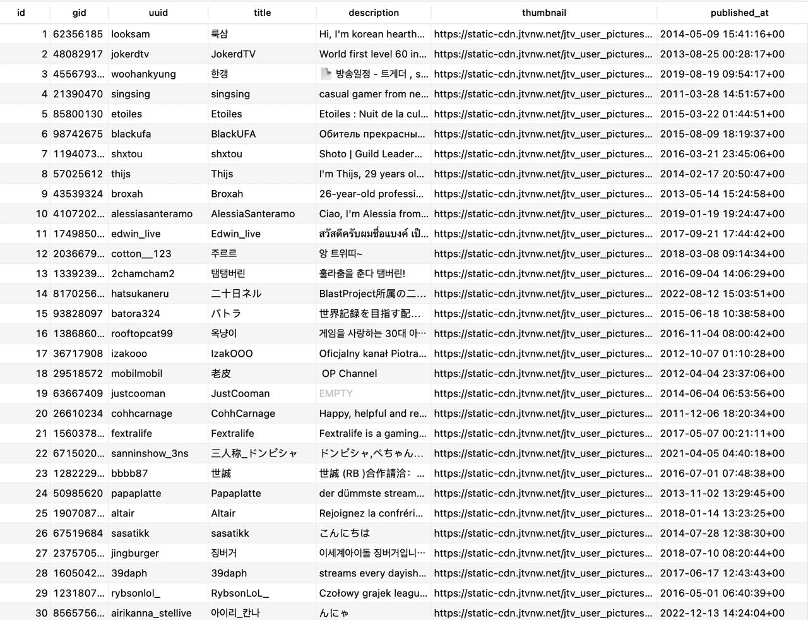
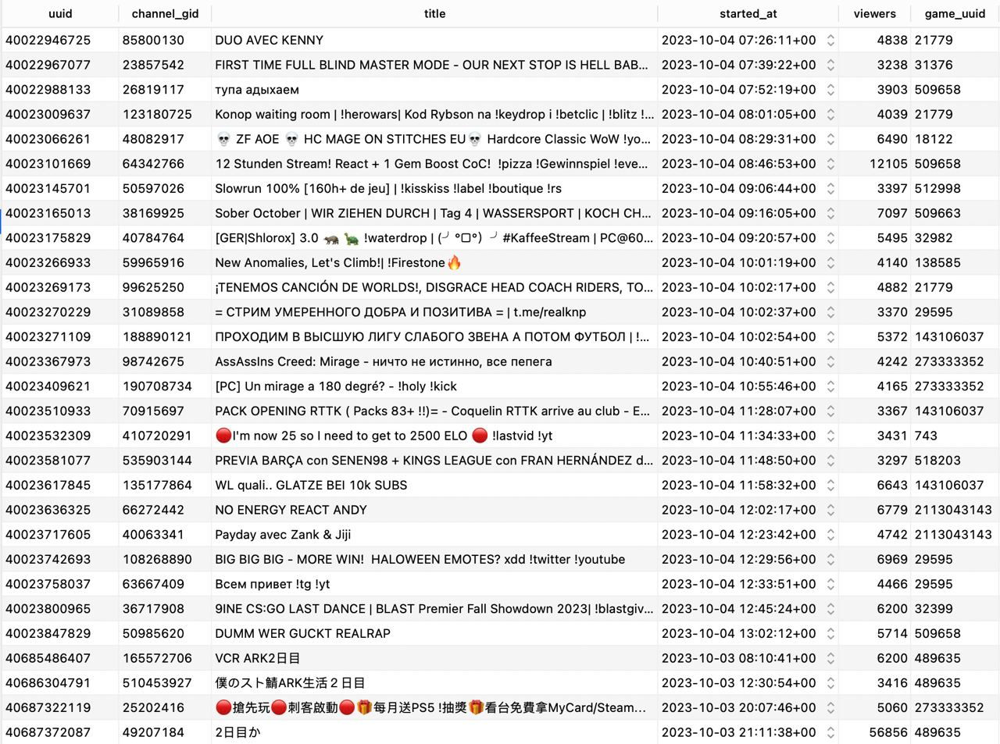

# INFLUENCERS TWITCH DATABASE

Scrape information about twitch streamers and save it to database. Connect to database using GraphQL. 

Users


Streams


### System requirements
* nodejs >=14
* postgresql >=10

### Installation
Copy **.env.sample** to **.env** and edit it

Then run
```bash
npm install
npm run db:migrate
```

### Configuration
You need to add twitch api keys to scrape data

Check table **twitch_api_keys** and record

```sql
INSERT INTO "public"."twitch_api_keys" ("id", "title", "data", "active")
VALUES(DEFAULT, 'my_key', '{"clientId": "***", "clientSecret": "***"}','t')
```

### Scrapping
For scraping current streams run following command
```bash
node ./src/cron/twitch.streams.scrape.js 1000
```
It will scrape 1000 current streams (100 per batch)

### Running graphql server
```bash
npm run app
```
visit http://localhost:3000/graphiql

### License

GNU General Public License v3.0


Developer @ncsft
